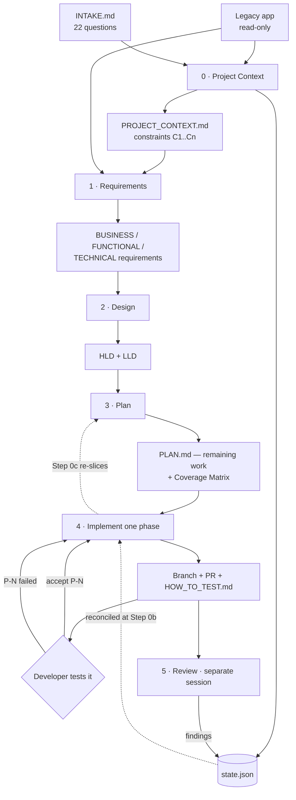
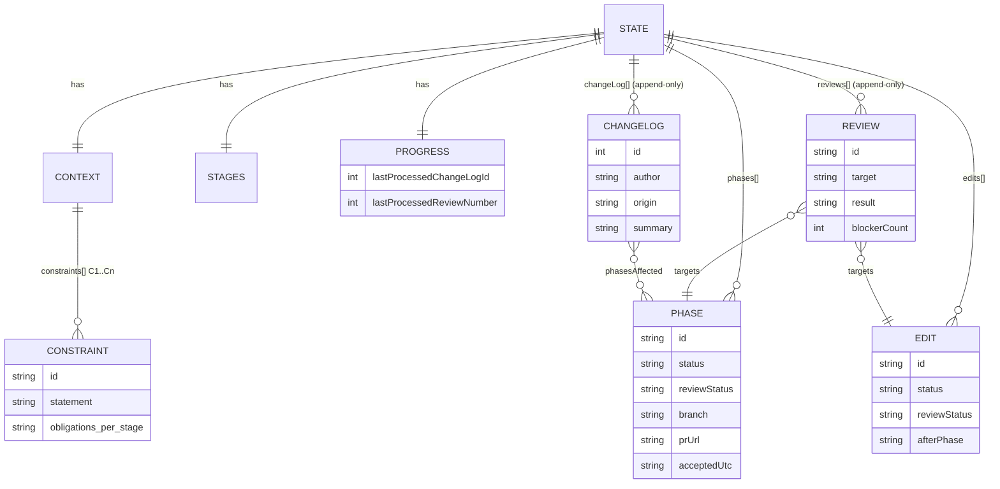
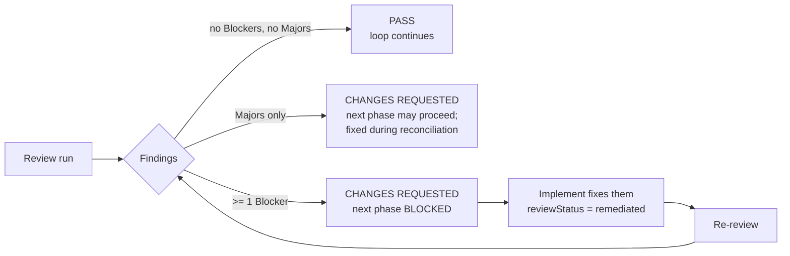

# Design — Agent Instruction Set 4

*How Set 4 is built, as currently implemented. Pairs with [REQUIREMENTS.md](REQUIREMENTS.md).*

---

## 1. Design in one paragraph

Set 4 is **ten Markdown files**. Six are stage instructions, invoked one per agent session;
two are templates the developer copies into their project; two are the guides. All coordination
between sessions happens through **two artifacts on disk** — human-readable Markdown documents
and one machine-readable `state.json`. Nothing is held in an agent's memory between runs,
because there is no "between runs": each stage session starts cold, reads state, does one unit
of work, writes state, and stops.

## 2. Components

| File | Kind | Responsibility |
|---|---|---|
| `AGENTS_TEMPLATE.md` | template → `AGENTS.md` | Invariants, authority ladder, and the acceptance-recording protocol. Loads in **every** session |
| `0_INTAKE_TEMPLATE.md` | template → `INTAKE.md` | The 22 questions, their defaults, and which 6 are load-bearing |
| `0_PROJECT_CONTEXT_INSTRUCTIONS.md` | stage | Resolve intake → `PROJECT_CONTEXT.md` + initialize `state.json` |
| `1_REQUIREMENTS_EXTRACTION_INSTRUCTIONS.md` | stage | Legacy code → business / functional / technical requirements |
| `2_DESIGN_INSTRUCTIONS.md` | stage | Requirements → HLD + LLD |
| `3_PLAN_INSTRUCTIONS.md` | stage | Design → phased plan + `phases[]` |
| `4_PHASE_IMPLEMENTATION_INSTRUCTIONS.md` | stage | Build one phase or one minor edit; open a PR; stop |
| `5_REVIEW_INSTRUCTIONS.md` | stage | Independent audit; findings back into `state.json` |
| `README.md` / `README_SHORT.md` | guide | The reasoning / the five-minute start |

## 3. Pipeline



Stages 0–2 run once each (and on rerun). Stages 3–4–5 are the loop.

## 4. Key design decisions

| # | Decision | Why |
|---|---|---|
| **DD-1** | **Constraints carry per-stage obligations**, defined once in `PROJECT_CONTEXT §4` | Stage files hold zero project-specific rules, so a new constraint needs no edit to any stage file. This is what makes Set 4 stack-agnostic (R1) |
| **DD-2** | **Split state from content**: `state.json` for machine state, Markdown for prose | Markdown status tables were unmergeable and drifted. JSON gives lineage, mechanical reconciliation, and diffable history (R7) |
| **DD-3** | **High-water mark** rather than "diff everything" | A run must distinguish new change-log entries from ones it already applied, without re-reading history each time (R7.3) |
| **DD-4** | **Two gates, different owners** — falsifiable exit criteria (agent) then `accepted` (human) | A self-check is only meaningful if it can fail; judgment stays with the person who ran the app (R4) |
| **DD-5** | **Permanent phase IDs; order lives in the plan** | PRs, branches, and reviews keep meaning what they said, even after re-slicing (R5.4) |
| **DD-6** | **Retrofit phases, never reopened accepted ones** | `accepted` is a human's attestation about what they tested; that stays true. The change is new work with its own acceptance (R6.3) |
| **DD-7** | **Contract changes are a two-prompt flow** (rerun Stage 2, then next phase) | The pause is the point — it's where the developer catches a design being amended into something they didn't intend |
| **DD-8** | **`AGENTS.md` always loaded** | Stage rules only bind when a stage is invoked; most drift happens in ordinary chat |
| **DD-9** | **One `HOW_TO_TEST.md`, regenerated each hand-off** | Per-phase test docs went stale. One file, always describing the app as it stands now |
| **DD-10** | **Plan defaults to "no change"** | Churn burns the developer's review attention and destabilizes what they thought was coming next |
| **DD-11** | **Review is a separate session, read-only on code** | An agent cannot audit its own work; read-only keeps the verdict honest |
| **DD-12** | **Documents amended in place; git is the history** | No `_v2` filenames; Revision History rows plus commits give lineage |

## 5. Data model — `state.json`



Rules that hold the model together:

- **Append-only:** `changeLog[]`, `reviews[]`, `edits[]`. Correct by superseding, never rewriting.
- **ID allocation:** `changeLog.id` = max + 1; `E-<n>` and `R-<n>` use the next unused *n* for
  their own array. IDs are never reused.
- **`progress` is numeric** — `R-10` sorts before `R-2` as a string, which would silently skip
  reviews.
- **`context.repo` / `context.deployment`** are decided *only* in Stage 0. Stage 2 fills
  `frontendRoot` / `backendRoot` if they were left null; nothing downstream may invent a layout.

## 6. Control flow of a build run (Stage 4)

```mermaid
sequenceDiagram
    participant D as Developer
    participant A as Build agent
    participant S as state.json
    participant G as Git

    D->>A: "Next phase. Branch and open a PR."
    A->>S: read phases[], changeLog[] > mark, reviews[] > mark
    A->>A: 0a classify — phase / contract change / minor edit
    alt un-remediated Blocker in scope
        A-->>D: stop — fix Blockers first
    else predecessor only `done`
        A-->>D: stop — "say accept P-N first"
    end
    A->>A: 0b reconcile changes since last run
    A->>A: 0c refresh plan (default: unchanged)
    opt re-slice needed
        A-->>D: propose; wait for approval
    end
    A->>G: branch, task-sized commits
    A->>A: run exit criteria (agent gate)
    A->>S: status=done, branch, prUrl, advance high-water mark
    A->>G: push + open PR
    A-->>D: report + HOW_TO_TEST.md + at-risk regression lines
    D->>D: test it
    D->>A: "accept P-N"
    A->>G: merge PR
    A->>S: status=accepted, acceptedUtc
```

## 7. The review gate



`remediated` is a claim awaiting confirmation, never a verdict. Nothing else clears the gate —
a review left at `changes-requested` blocks indefinitely, by design.

## 8. Conflict resolution

A single ladder, stated in `AGENTS.md` and repeated by reference only:

**constraint (`PROJECT_CONTEXT §4`) → plan → LLD → HLD → requirements → rest of context**

A constraint always wins; if honoring it breaks a design contract, that is a blocker for a
human, not a choice the agent makes. Material conflicts are reported, not resolved.

## 9. Traceability

| Requirement | Realized by |
|---|---|
| R1 stack-agnostic | DD-1 constraints + obligations; `context.currentStack` / `targetStack` |
| R2 load-bearing questions | `0_INTAKE_TEMPLATE.md` defaults / hard-stops; Stage 0 Step 1 |
| R3 document order | Stage files 0–5; `stages.<name>.status` |
| R4 two-tier acceptance | Plan §Two-Tier Acceptance; `AGENTS.md` §Recording What the Developer Tells You |
| R5 rolling plan | Plan §Refreshing the Plan; Stage 4 Step 0c; Coverage Matrix |
| R6 mid-build change | Stage 4 §0a, §When a Change Touches a Contract; retrofit phases |
| R7 machine state | `state.json` schema (Stage 0 Output 2); `progress` high-water mark |
| R8 review | Stage 5 verdict rules; `reviews[]`; Blocker gate in Stage 4 §Inputs |
| R9 governance | `AGENTS.md` invariants + authority ladder |
| R10 testability | Stage 4 Step 2.3 `HOW_TO_TEST.md`; plan test guides |
| R11 git | Stage 4 §Git Discipline |

## 10. Known trade-offs

- **Prompt-only enforcement.** Every rule depends on the agent following instructions; there is
  no linter or schema validator on `state.json`. Mitigated by falsifiable exit criteria,
  `AGENTS.md` in every session, and an independent Stage 5.
- **Non-sequential phase IDs** confuse at first read. Deliberate (DD-5); the plan's summary
  table carries the running order.
- **Volume.** ~3,600 lines of instruction across the set; the two READMEs exist to keep the
  entry cost low (Q1).
- **Git-dependent history.** Superseded design and plan versions exist only as commits, so a
  project that keeps `./out/` out of git loses the lineage the Implement stage diffs against.
