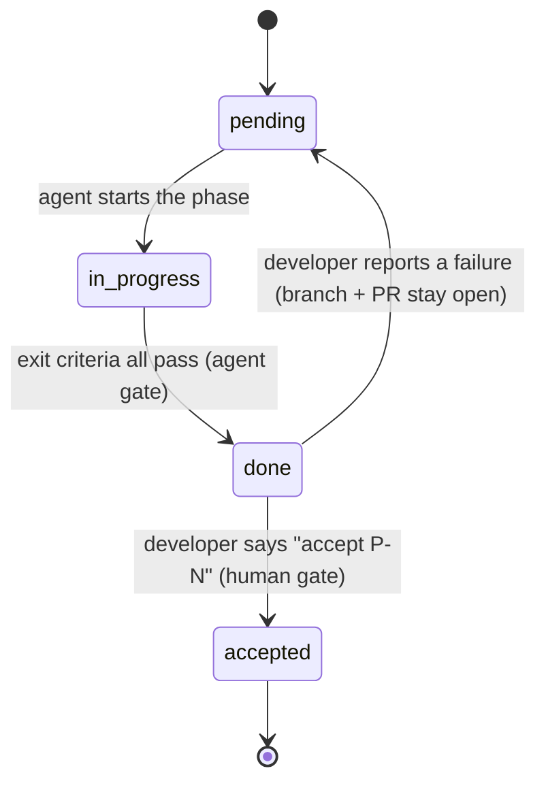

# Requirements — Agent Instruction Set 4

*What Set 4 is required to do, as currently implemented. Reverse-engineered from the six stage
files, the two templates, and `README.md`.*

---

## 1. Purpose

Set 4 is a **prompt-based process** — not code — that lets one developer modernize a legacy
application with a coding agent, **one small testable increment at a time**, without losing
control of scope, quality, or history.

It ships as Markdown files the developer copies into their project and cites in prompts. No
runtime, no installer, no tooling to maintain.

## 2. Users & actors

| Actor | Role |
|---|---|
| **Developer** | Drives the pipeline, tests each increment, and is the *only* one who can accept work |
| **Build agent** | Any LLM coding agent, running one stage per session |
| **Review agent** | The same, in a *separate* session, auditing what the build agent produced |

## 3. Scope

**In scope:** intake, requirements extraction, design, phased planning, incremental
implementation, and independent review — plus the state and paper trail that ties them together.

**Out of scope:** running the legacy app, executing data migration, deployment, load testing,
and anything that modifies the legacy source (read-only in every stage).

---

## 4. Functional requirements

### R1 — Stack-agnostic parameterization
- **R1.1** No source or target technology may be hardcoded in any stage file.
- **R1.2** All project-specific facts (stacks, CI/CD, cutover, repo layout, deployment topology)
  are captured **once**, in Stage 0, and read by every later stage.
- **R1.3** Project rules are expressed as **constraints with stable IDs** (`C1`, `C2`, …), each
  carrying **per-stage obligations**. Adding a constraint must require **no edit to any stage file**.

### R2 — Load-bearing questions get decided, not guessed
- **R2.1** Intake asks 22 questions; **6 block the pipeline** (current stack, target stack,
  DB reuse, legacy coexistence, auth, cutover strategy).
- **R2.2** A blank non-load-bearing answer gets a **stated default**; a blank load-bearing
  answer is a **hard stop**.
- **R2.3** Every answer the agent supplied on the developer's behalf must be reported back.
- **R2.4** Inferred facts are marked `ASSUMPTION:`; unresolved ones `OPEN QUESTION:`.

### R3 — Documents are produced in a fixed order

| Stage | Produces |
|---|---|
| 0 Context | `PROJECT_CONTEXT.md`, `state.json` |
| 1 Requirements | Business / Functional / Technical requirements |
| 2 Design | HLD + LLD (the LLD is the authoritative contract) |
| 3 Plan | `PLAN_<App>.md` (remaining work only) + `state.json phases[]` |
| 4 Implement | Code, a PR, a regenerated `HOW_TO_TEST.md` |
| 5 Review | `REVIEW_<Rid>_<App>_<target>.md` + findings in `state.json` |

- **R3.1** Every stage supports a **rerun with Additional Instructions**. Documents are amended
  in place with a Revision History row; git is the only version history.

### R4 — Two-tier acceptance
- **R4.1** The agent may set a phase `done` only when its **mechanical, falsifiable** exit
  criteria all pass. Subjective criteria ("looks correct") are forbidden.
- **R4.2** Only the developer sets `accepted` — per item, as its own explicit instruction naming
  the item. Never inferred, never bundled into "run the next phase", never batched.
- **R4.3** The next phase must not start while its predecessor is only `done`.

### R5 — Rolling plan
- **R5.1** The plan covers **remaining work only**; accepted phases drop to a Completed line.
- **R5.2** Stage 4 re-checks the remaining plan before most runs, and **defaults to no change**.
- **R5.3** A re-slice must be **proposed and approved** before it is applied.
- **R5.4** Phase IDs are **permanent** — never renumbered or reused. Execution order lives in
  the plan document, not in the IDs.
- **R5.5** The **Coverage Matrix** holds one row per requirement, and rows are **never deleted**.

### R6 — Changes mid-build
- **R6.1** The agent classifies each request itself — **phase**, **contract change**, or **minor
  edit**. The test is *authority*, not size.
- **R6.2** A change touching a requirement, design contract, or plan scope is **not implemented
  that run**: the agent names the owning document, recommends the stage, logs it, and stops.
- **R6.3** Accepted phases are **never reopened** for a design change. The fix is a new
  **retrofit phase**, sequenced before anything that would build on the old contract.
- **R6.4** Minor edits (`E-n`) get their own id, branch, PR, status, and review identity, and
  behave exactly like phases for acceptance.

### R7 — Machine state
- **R7.1** `state.json` is the single source of truth for progress, lineage, and change history;
  Markdown holds content only.
- **R7.2** `changeLog[]`, `reviews[]`, `edits[]` are **append-only**; corrections supersede.
- **R7.3** A **high-water mark** (`lastProcessedChangeLogId`, `lastProcessedReviewNumber`, both
  integers) tells each run which entries it has already folded in.
- **R7.4** The developer never hand-edits `state.json` — they say what happened, the agent
  records it and confirms.

### R8 — Independent review
- **R8.1** Review runs in a **separate session**; it never reviews code written in the same run.
- **R8.2** It covers requirement coverage, automated tests, security, and static performance.
- **R8.3** Findings are graded Blocker / Major / Minor. **Blockers gate the next phase**
  (whether the target was a phase, an edit, or the whole build); Majors ride along.
- **R8.4** The gate clears only when Implement marks the target `remediated`; a re-review is what
  returns it to `pass`.
- **R8.5** Review is read-only on code, design, and requirements.

### R9 — Always-on governance
- **R9.1** `AGENTS.md` loads in **every** session, so the invariants apply to ordinary chat, not
  just formal stage runs.
- **R9.2** Out-of-band developer edits are logged to `changeLog[]` so the next run sees them.
- **R9.3** Conflicts resolve by a fixed ladder — **constraint → plan → LLD → HLD → requirements →
  context** — and a material conflict is *reported, never silently resolved*.

### R10 — Testability hand-off
- **R10.1** Every phase ends runnable and manually testable.
- **R10.2** Exactly **one** `HOW_TO_TEST.md` exists, regenerated at every hand-off: *New in P-N*
  in full detail, then an accumulating, condensed *Regression* section.
- **R10.3** Changed behavior edits its Regression lines **in place** — no line may describe
  something that no longer works.
- **R10.4** The hand-off report names which regression checks this phase put at risk.

### R11 — Git discipline
- **R11.1** Branch per unit of work, small self-describing commits, a PR whose body records
  initial task / reasoning / outcome.
- **R11.2** The agent **never merges** except as part of recording an acceptance — and not even
  then if the repo requires reviewers or green CI.

---

## 5. Quality requirements

| # | Requirement |
|---|---|
| Q1 | **Readable in five minutes** — `README_SHORT.md` gets a developer running; `README.md` carries the reasoning |
| Q2 | **No duplicated rules** — a constraint-specific rule lives in its obligation, once |
| Q3 | **Falsifiability** — every gate the agent self-checks is objectively checkable |
| Q4 | **Low prompt cost** — steady state is one prompt per phase; a mid-build design change costs exactly one extra |
| Q5 | **Auditability** — every state change traces to a `changeLog[]` entry and a git commit |

## 6. Invariants (never violated, in any stage or ad-hoc chat)

1. Legacy source is **read-only**.
2. `INTAKE.md` and the `*_TEMPLATE.md` files are **inputs, never written to**.
3. `changeLog[]` and `reviews[]` are **append-only**.
4. Only the developer authorizes `accepted`, one item at a time.
5. **No secrets** in code, docs, state, commit messages, or PR bodies.
6. Never mutate a reused database's schema — fix the mapping instead.

---

## 7. The lifecycle every phase must follow

*An `accepted` phase is never reopened for a design change — that becomes a new retrofit phase.*
