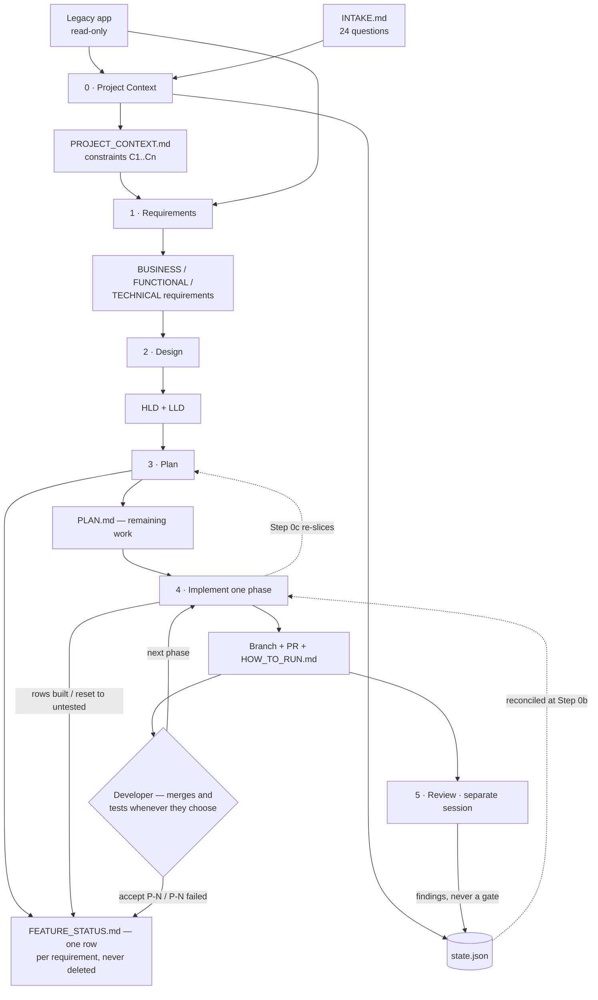
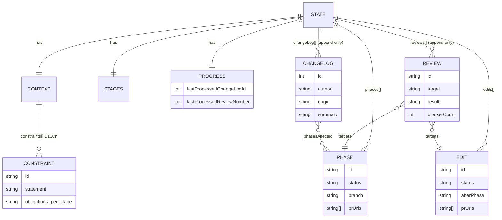
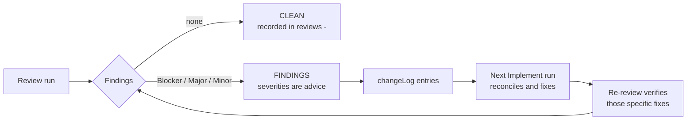

# Design — Modernization Harness

*How the harness is built, as currently implemented. Pairs with [REQUIREMENTS.md](REQUIREMENTS.md).*

---

## 1. Design in one paragraph

The harness is **eleven Markdown files**. Six are stage instructions, invoked one per agent session;
two are templates the developer copies into their project; three are the guides. All coordination
between sessions happens through **two artifacts on disk** — human-readable Markdown documents
and one machine-readable `state.json`. Nothing is held in an agent's memory between runs,
because there is no "between runs": each stage session starts cold, reads state, does one unit
of work, writes state, and stops.

## 2. Components

| File | Kind | Responsibility |
|---|---|---|
| `AGENTS_TEMPLATE.md` | template → `AGENTS.md` | Invariants, authority ladder, and the protocol for recording what the developer tells you. Loads in **every** session |
| `0_INTAKE_TEMPLATE.md` | template → `INTAKE.md` | The 24 questions, their defaults, and which 6 are load-bearing |
| `0_PROJECT_CONTEXT_INSTRUCTIONS.md` | stage | Resolve intake → `PROJECT_CONTEXT.md` + initialize `state.json` |
| `1_REQUIREMENTS_EXTRACTION_INSTRUCTIONS.md` | stage | Legacy code → business / functional / technical requirements |
| `2_DESIGN_INSTRUCTIONS.md` | stage | Requirements → HLD + LLD |
| `3_PLAN_INSTRUCTIONS.md` | stage | Design → phased plan + `phases[]` |
| `4_PHASE_IMPLEMENTATION_INSTRUCTIONS.md` | stage | Build one phase or one minor edit; open a PR; stop |
| `5_REVIEW_INSTRUCTIONS.md` | stage | Independent audit; findings back into `state.json` |
| `DEVELOPER_GUIDE.md` / `README.md` / `USE_CASES.md` | guide | The reasoning / the five-minute start / the situations you'll hit, by example |

## 3. Pipeline



**Nothing on this diagram blocks.** The developer's testing and the Review stage both feed the
loop without holding it: the only gate is a phase's own falsifiable exit criteria.

Stages 0–2 run once each (and on rerun). Stages 3–4–5 are the loop.

## 4. Key design decisions

| # | Decision | Why |
|---|---|---|
| **DD-1** | **Constraints carry per-stage obligations**, defined once in `PROJECT_CONTEXT §4` | Stage files hold zero project-specific rules, so a new constraint needs no edit to any stage file. This is what makes the harness stack-agnostic (R1) |
| **DD-2** | **Split state from content**: `state.json` for machine state, Markdown for prose | Markdown status tables were unmergeable and drifted. JSON gives lineage, mechanical reconciliation, and diffable history (R7) |
| **DD-3** | **High-water mark** rather than "diff everything" | A run must distinguish new change-log entries from ones it already applied, without re-reading history each time (R7.3) |
| **DD-4** | **One gate: falsifiable exit criteria.** Status moves `pending → in progress → done`, forward only | The acceptance gate cost the developer an hour of testing before any further building, so it forced a choice between working and claiming something untrue. Removing it leaves the self-check — which is meaningful only because it can fail (R4) |
| **DD-5** | **Permanent phase IDs; order lives in the plan** | PRs, branches, and reviews keep meaning what they said, even after re-slicing (R5.4) |
| **DD-6** | **Retrofit phases, never reopened `done` ones** | What is built is built: a delivered phase's ID, scope and place in history stay as written, and the change is new work that supersedes its behavior (R6.3) |
| **DD-7** | **Contract changes are a two-prompt flow** (rerun Stage 2, then next phase) | The pause is the point — it's where the developer catches a design being amended into something they didn't intend |
| **DD-8** | **`AGENTS.md` always loaded** | Stage rules only bind when a stage is invoked; most drift happens in ordinary chat |
| **DD-9** | **`HOW_TO_RUN.md` (how to run it) + `FEATURE_STATUS.md` (what is built and tested)** | Per-phase test docs went stale, and one regenerated file duplicated the plan's own test guides. Splitting *how to run* from *what to check* leaves each written once: the run doc changes only when running changes, and each feature's check sits beside the column the developer ticks (R10) |
| **DD-13** | **Testing is tracked per feature, not per phase** | A phase is a batch of work; a later phase can change what an earlier one delivered, and a phase-level mark cannot express that. A feature row can — it gains the new phase and resets to `untested` (R4.3, UL-5) |
| **DD-14** | **Branch from the currently checked-out branch, PR back at it, and never merge unasked** | The developer's git state becomes the instruction, so nothing needs configuring — and because the next phase starts from where the last one's code already is, *no merge is required for the pipeline to work*. That removes the merge trigger, the permission question, `mergePolicy` and `mergedUtc` in one go. The agent still merges on an explicit "merge P-3", because refusing a direct instruction about the developer's own repo buys nothing (R11.2) |
| **DD-17** | **Before branching, detect a branch that is already merged or gone from the remote, and propose the alternative** | Reading the current branch makes the *unusual* path (never merging) frictionless and the *common* one broken: the developer merges on the host, the host deletes the branch, their checkout stays on it, and every content check still passes because the code is present. Without this the next phase silently targets a branch that no longer exists (R11.5) |
| **DD-15** | **Git is the truth; `state.json` is a cache** — presence checked by content, never by branch-merge status | The developer may merge or edit outside the harness and should not have to report it; squash and rebase merges make branch-based checks answer "not merged" when every line is present. Nothing records merges at all, so there is nothing to keep in step (R11.3) |
| **DD-16** | **`prTarget` is kept as a human note that no rule reads** | Where work lands is decided by which branch the developer stands on, not by a field. Keeping the field documents intent; reading it would resurrect a setting the branching rule replaced |
| **DD-10** | **Plan defaults to "no change"** | Churn burns the developer's review attention and destabilizes what they thought was coming next |
| **DD-11** | **Review is a separate session, read-only on code, and never blocks** | An agent cannot audit its own work; read-only keeps the verdict honest. The gate it used to hold only ever fired for a developer who chose to run it, and its findings already survive through the change log — so it reports and advises instead (R8) |
| **DD-12** | **Documents amended in place; git is the history** | No `_v2` filenames; Revision History rows plus commits give lineage |

## 5. Data model — `state.json`



`state.json` holds **machine facts only**. What a human has tested is not in it: that lives in
`FEATURE_STATUS.md`, keyed by requirement ID, because a later phase can change what an earlier
one delivered (DD-13). A review has no status to set on its target (DD-11), so there is no
`reviewStatus` anywhere and no `wholeBuild` record.

Rules that hold the model together:

- **Append-only:** `changeLog[]`, `reviews[]`. Correct by superseding, never rewriting.
  `edits[]` entries are never deleted or renumbered, but their lifecycle fields are updated in
  place, like `phases[]`.
- **ID allocation:** `changeLog.id` = max + 1; `E-<n>` and `R-<n>` use the next unused *n* for
  their own array. IDs are never reused.
- **`progress` is numeric** — `R-10` sorts before `R-2` as a string, which would silently skip
  reviews.
- **`context.repo` / `context.deployment`** are decided *only* in Stage 0, which is also the
  only stage that writes them. Where `frontendRoot` / `backendRoot` were left null, Stage 2
  settles the tree in **LLD §3a** rather than in state; nothing downstream may invent a layout.

## 6. Control flow of a build run (Stage 4)

```mermaid
sequenceDiagram
    participant D as Developer
    participant A as Build agent
    participant S as state.json
    participant F as FEATURE_STATUS.md
    participant G as Git

    D->>A: "Next phase. Branch and open a PR."
    A->>S: read phases[], changeLog[] > mark, reviews[] > mark
    A->>G: read CURRENT branch; check by content for predecessor's work
    A-->>D: "Branching P-3 from <current>. Contains P-2's work."
    A->>A: 0a classify — phase / contract change / minor edit
    A->>A: 0b reconcile changes + review findings since last run
    A->>A: 0c refresh plan (default: unchanged)
    opt re-slice needed
        A-->>D: propose; wait for approval
    end
    A->>G: branch from current, task-sized commits
    A->>A: run exit criteria (the only gate)
    A->>S: status=done, branch, prUrls, advance high-water mark
    A->>F: rows built in P-3; rows P-3 changed reset to untested
    A->>G: push + open PR targeting the branch it came from
    A-->>D: report + 2 counts + PR link (+ other open PRs)
    Note over D,G: the developer merges whenever they choose, or not at all
    Note over D,F: testing happens whenever — "accept P-3" ticks rows, gates nothing
```

## 7. Review, and why nothing blocks



The gate this stage used to hold only ever fired for a developer who **chose** to run a review —
it punished the careful and protected nobody else. Its findings already survived without it, via
the change log and the `lastProcessedReviewNumber` high-water mark; the gate only changed *when*
they were fixed, not *whether*. So Review states plainly what it would not build on, and the
developer decides.

That leaves the pipeline with **no hard gate but a phase's own exit criteria**. The trade is
recorded in §10.

## 8. Conflict resolution

A single ladder, stated in `AGENTS.md` and repeated by reference only:

**constraint (`PROJECT_CONTEXT §4`) → plan → LLD → HLD → requirements → rest of context**

A constraint always wins; if honoring it breaks a design contract, that is a blocker for a
human, not a choice the agent makes. Material conflicts are reported, not resolved.

## 9. Traceability

| Requirement | Realized by |
|---|---|
| R1 stack-agnostic | DD-1 constraints + obligations; `context.currentStack` / `targetStack` |
| R2 load-bearing questions | `0_INTAKE_TEMPLATE.md` defaults / hard-stops; Stage 0 Step 1 |
| R3 document order | Stage files 0–5; `stages.<name>.status` |
| R4 one gate + testing record | Plan §The Only Gate; `FEATURE_STATUS.md`; `AGENTS.md` §Recording What the Developer Tells You |
| R5 rolling plan | Plan §Refreshing the Plan; Stage 4 Step 0c; `FEATURE_STATUS.md` |
| R6 mid-build change | Stage 4 §0a, §When a Change Touches a Contract; retrofit phases |
| R7 machine state | `state.json` schema (Stage 0 Output 2); `progress` high-water mark |
| R8 review | Stage 5 §Outcome; `reviews[]`; findings reconciled at Stage 4 Step 0b |
| R9 governance | `AGENTS.md` invariants + authority ladder |
| R10 testability | Stage 4 Step 2.3–2.4 (`FEATURE_STATUS.md`, `HOW_TO_RUN.md`); plan test guides |
| R11 git | Stage 4 §Git Discipline, §Starting From the Right Base (incl. the spent-branch check) |

## 10. Known trade-offs

- **No hard gates remain.** Nothing prevents a bad build from growing except the developer
  reading the reports — the two counts at every hand-off, and Stage 5 when they run it.
  Defensible for a modernization build with one user and nothing deployed; it would not be for
  a team shipping to production, and whoever inherits this harness should know that is the
  trade that was made.
- **Untested code reaches a branch only when the developer merges it there.** The agent never
  merges, so nothing lands on `main` without a human clicking Merge. The cost is the mirror
  image: if they never merge, phases stack as a chain of open PRs, landed later **oldest first**
  (each merge makes the host re-point the PR above it at the base branch). The hand-off report
  names the other open PRs so the height of that stack is at least visible — there is no setting
  that controls this, and no agent-side protection to rely on.
- **Prompt-only enforcement.** Every rule depends on the agent following instructions; there is
  no linter or schema validator on `state.json`. Mitigated by falsifiable exit criteria,
  `AGENTS.md` in every session, and an independent Stage 5.
- **Non-sequential phase IDs** confuse at first read. Deliberate (DD-5); the plan's summary
  table carries the running order.
- **Volume.** ~2,900 lines of instruction across the six stage files and two templates;
  the three guides exist to keep the entry cost low (Q1).
- **Git-dependent history.** Superseded design and plan versions exist only as commits, so a
  project that keeps `./out/` out of git loses the lineage the Implement stage diffs against.
