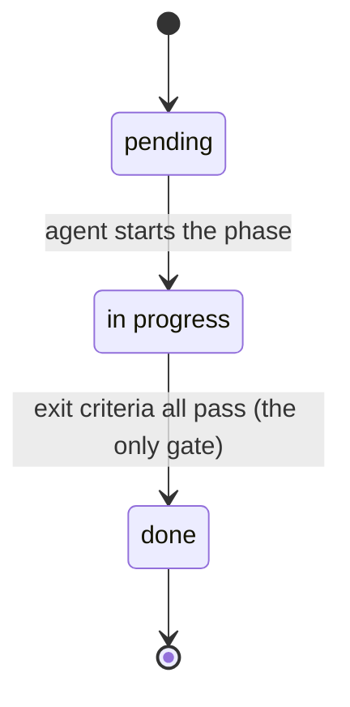

# Requirements — Modernization Harness

*What the harness is required to do, as currently implemented. Reverse-engineered from the six stage
files, the two templates, and `DEVELOPER_GUIDE.md`.*

---

## 1. Purpose

The harness is a **prompt-based process** — not code — that lets one developer modernize a legacy
application with a coding agent, **one small testable increment at a time**, without losing
control of scope, quality, or history.

It ships as Markdown files the developer copies into their project and cites in prompts. No
runtime, no installer, no tooling to maintain.

## 2. Users & actors

| Actor | Role |
|---|---|
| **Developer** | Drives the pipeline, merges, and is the *only* one who can record that something was tested |
| **Build agent** | Any LLM coding agent, running one stage per session |
| **Review agent** | The same, in a *separate* session, auditing what the build agent produced |

## 3. Scope

**In scope:** intake, requirements extraction, design, phased planning, incremental
implementation, and independent review — plus the state and paper trail that ties them together.

**Out of scope:** running the legacy app, executing data migration, deployment, load testing,
and anything that modifies the legacy source (read-only in every stage).

---

## 4. Functional requirements

### R1 — Stack-agnostic parameterization
- **R1.1** No source or target technology may be hardcoded in any stage file.
- **R1.2** All project-specific facts (stacks, CI/CD, cutover, repo layout, deployment topology)
  are captured **once**, in Stage 0, and read by every later stage.
- **R1.3** Project rules are expressed as **constraints with stable IDs** (`C1`, `C2`, …), each
  carrying **per-stage obligations**. Adding a constraint must require **no edit to any stage file**.

### R2 — Load-bearing questions get decided, not guessed
- **R2.1** Intake asks 24 questions; **6 block the pipeline** (current stack, target stack,
  DB reuse, legacy coexistence, auth, cutover strategy).
- **R2.2** A blank non-load-bearing answer gets a **stated default**; a blank load-bearing
  answer is a **hard stop**.
- **R2.3** Every answer the agent supplied on the developer's behalf must be reported back.
- **R2.4** Inferred facts are marked `ASSUMPTION:`; unresolved ones `OPEN QUESTION:`.

### R3 — Documents are produced in a fixed order

| Stage | Produces |
|---|---|
| 0 Context | `PROJECT_CONTEXT.md`, `state.json` |
| 1 Requirements | Business / Functional / Technical requirements |
| 2 Design | HLD + LLD (the LLD is the authoritative contract) |
| 3 Plan | `PLAN_<App>.md` (remaining work only) + `state.json phases[]` |
| 4 Implement | Code, a PR, updated `FEATURE_STATUS.md` rows |
| 5 Review | `REVIEW_<Rid>_<App>_<target>.md` + findings in `state.json` |

- **R3.1** Every stage supports a **rerun with Additional Instructions**. Documents are amended
  in place with a Revision History row; git is the only version history.

### R4 — One gate, and a testing record
- **R4.1** The agent may set a phase `done` only when its **mechanical, falsifiable** exit
  criteria all pass. Subjective criteria ("looks correct") are forbidden. **This is the only
  gate in the pipeline.**
- **R4.2** Phase and edit status moves **forward only** — `pending` → `in progress` → `done`.
  Nothing rewinds; `done` is terminal. What is built is built.
- **R4.3** Whether a human has tested the work is recorded **per feature** in
  `FEATURE_STATUS.md`, never as a phase status, because a later phase can change what an
  earlier one delivered.
- **R4.4** Only the developer authorizes a `passed` or `failed` mark, and it **blocks nothing**.
  Several may be recorded at once when they name them. An agent may write `untested` — and must,
  for any row whose behavior it changed.

### R5 — Rolling plan
- **R5.1** The plan covers **remaining work only**; `done` phases drop to a Completed line,
  tested or not.
- **R5.2** Stage 4 re-checks the remaining plan before most runs, and **defaults to no change**.
- **R5.3** A re-slice must be **proposed and approved** before it is applied.
- **R5.4** Phase IDs are **permanent** — never renumbered or reused. Execution order lives in
  the plan document, not in the IDs.
- **R5.5** **`FEATURE_STATUS.md`** holds one row per requirement, and rows are **never
  deleted** — the plan is a forecast, the ledger is the commitment.

### R6 — Changes mid-build
- **R6.1** The agent classifies each request itself — **phase**, **contract change**, or **minor
  edit**. The test is *authority*, not size.
- **R6.2** A change touching a requirement, design contract, or plan scope is **not implemented
  that run**: the agent names the owning document, recommends the stage, logs it, and stops.
- **R6.3** `done` phases are **never reopened** for a design change. The fix is a new
  **retrofit phase**, sequenced before anything that would build on the old contract.
- **R6.4** Minor edits (`E-n`) get their own id, branch, PR, status, and review identity, and
  behave exactly like phases throughout.

### R7 — Machine state
- **R7.1** `state.json` is the single source of truth for progress, lineage, and change history;
  Markdown holds content only.
- **R7.2** `changeLog[]` and `reviews[]` are **append-only**; corrections supersede. `edits[]`
  entries are never deleted or renumbered, but their lifecycle fields update in place, as
  `phases[]` entries' do (R6.4).
- **R7.3** A **high-water mark** (`lastProcessedChangeLogId`, `lastProcessedReviewNumber`, both
  integers) tells each run which entries it has already folded in.
- **R7.4** The developer never hand-edits `state.json` — they say what happened, the agent
  records it and confirms.

### R8 — Independent review
- **R8.1** Review runs in a **separate session**; it never reviews code written in the same run.
- **R8.2** It covers requirement coverage, automated tests, security, and static performance.
- **R8.3** Findings are graded Blocker / Major / Minor. **Severities are information, never a
  gate** — a review blocks nothing, whatever it finds.
- **R8.4** Findings become `changeLog[]` entries the next Implement run reconciles and fixes;
  `progress.lastProcessedReviewNumber` tracks what has been dealt with. A review reports what
  is built vs. what was asked for, and what remains untested.
- **R8.5** Review is read-only on code, design, and requirements.

### R9 — Always-on governance
- **R9.1** `AGENTS.md` loads in **every** session, so the invariants apply to ordinary chat, not
  just formal stage runs.
- **R9.2** Out-of-band developer edits are logged to `changeLog[]` so the next run sees them.
- **R9.3** Conflicts resolve by a fixed ladder — **constraint → plan → LLD → HLD → requirements →
  context** — and a material conflict is *reported, never silently resolved*.

### R10 — Testability hand-off
- **R10.1** Every phase ends runnable and manually testable.
- **R10.2** Exactly **one** `HOW_TO_RUN.md` exists — how to build, run and configure the app —
  updated only when that actually changes, and its commands run by the agent at hand-off.
- **R10.3** Per-feature checks live in `FEATURE_STATUS.md`, beside the tested column. Changed
  behavior edits its check **in place** and resets the row to `untested` — no check may describe
  something that no longer works, and no `passed` mark may outlive the behavior it vouched for.
- **R10.4** Every hand-off report carries **two counts** — features awaiting testing, and open
  review findings — plus the rows this phase put at risk.

### R11 — Git discipline
- **R11.1** Branch per unit of work, small self-describing commits, a PR whose body records
  initial task / reasoning / outcome.
- **R11.2** The agent branches from **the currently checked-out branch** and targets its PR at
  it, so not merging simply stacks the next phase. It merges at hand-off per
  `context.repo.mergePolicy` (`ask` by default) — and never where the repo requires reviewers or
  green CI.
- **R11.3** Presence of work is checked **by content**, never by branch-merge status: git is the
  truth and `state.json` is a cache. Work merged or edited outside the harness is detected, not
  reported by the developer.

---

## 5. Quality requirements

| # | Requirement |
|---|---|
| Q1 | **Readable in five minutes** — `README.md` gets a developer running; `DEVELOPER_GUIDE.md` carries the reasoning; `USE_CASES.md` walks the situations by example |
| Q2 | **No duplicated rules** — a constraint-specific rule lives in its obligation, once |
| Q3 | **Falsifiability** — every gate the agent self-checks is objectively checkable |
| Q4 | **Low prompt cost** — steady state is one prompt per phase; a mid-build design change costs exactly one extra |
| Q5 | **Auditability** — every state change traces to a `changeLog[]` entry and a git commit |

## 6. Invariants (never violated, in any stage or ad-hoc chat)

1. Legacy source is **read-only**.
2. `INTAKE.md` and the `*_TEMPLATE.md` files are **inputs, never written to**.
3. `changeLog[]` and `reviews[]` are **append-only**.
4. Only the developer authorizes a `passed`/`failed` mark — and it gates nothing.
5. **No secrets** in code, docs, state, commit messages, or PR bodies.
6. Never mutate a reused database's schema — fix the mapping instead.

---

## 7. The lifecycle every phase must follow

*Forward only. `done` is terminal — a failure the developer reports, or a design change that
invalidates the work, becomes new forward work, never a reopened phase. Whether a human has
tested it is tracked separately, per feature, in `FEATURE_STATUS.md`.*
